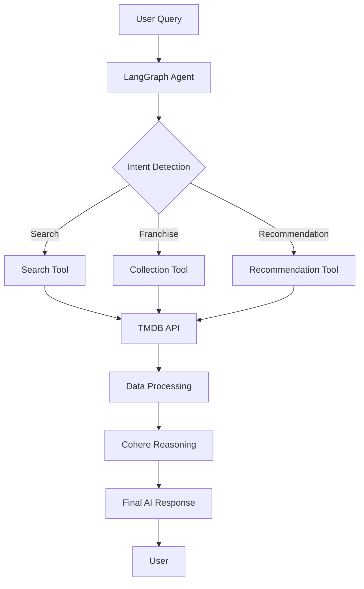

# 🎬 MovieVerse AI

  
  
  
  
  
  

  <strong>An intelligent Agentic AI movie assistant that understands movie-related queries, searches live movie data, recommends watch orders, remembers conversations, and provides personalized recommendations.</strong>

  <a href="#-features">Features</a> •
  <a href="#-tech-stack">Tech Stack</a> •
  <a href="#-installation">Installation</a> •
  <a href="#-usage">Usage</a> •
  <a href="#-api-endpoints">API Endpoints</a> •
  <a href="#-contributing">Contributing</a> •
  <a href="#-license">License</a>

---

## 📌 Features

| Feature | Description |
|---------|-------------|
| 🤖 **Agentic AI** | Powered by LangGraph for intelligent decision making |
| 🧠 **Cohere LLM** | Advanced language model integration for natural conversations |
| 🎬 **TMDB API** | Access to comprehensive movie database |
| 🔍 **Intelligent Search** | Smart movie search with contextual understanding |
| 🎞 **Franchise Detection** | Automatically identifies movie franchises and series |
| 🍿 **Watch Order** | Recommends optimal viewing order for movie series |
| ⭐ **Similar Movies** | Finds movies similar to your favorites |
| 💬 **Context Aware** | Maintains conversation context across interactions |
| 🧠 **Persistent Memory** | Remembers user preferences and conversation history |
| 🎭 **Rich UI** | Movie posters, cards, and responsive design |
| ⚡ **FastAPI Backend** | High-performance asynchronous API |
| ⚛️ **Next.js Frontend** | Modern React framework with SSR capabilities |

---

## 🛠 Tech Stack

### Frontend
- **Framework:** Next.js 15
- **Language:** TypeScript
- **Styling:** Tailwind CSS
- **State Management:** React Hooks
- **HTTP Client:** Fetch API

### Backend
- **Framework:** FastAPI
- **Language:** Python 3.11+
- **AI Framework:** LangGraph
- **LLM:** Cohere Chat API
- **HTTP Client:** HTTPX
- **Data Validation:** Pydantic

### APIs & Services
- **Movie Data:** TMDB API
- **LLM Service:** Cohere API
- **Memory Storage:** JSON-based persistent storage

---

## 🧠 Agent Workflow

## Project Structure

MovieVerse-AI/
│
├── backend/                          # Backend API & Agent
│   ├── agent/                        # LangGraph Agent Implementation
│   │   ├── graph.py                  # Agent workflow graph
│   │   ├── nodes.py                  # Node implementations
│   │   ├── prompts.py                # Prompt templates
│   │   ├── state.py                  # State management
│   │   └── tools.py                  # Tool definitions
│   │
│   ├── api/                          # API Routes
│   │   ├── chat.py                   # Chat endpoints
│   │   └── movie.py                  # Movie endpoints
│   │
│   ├── memory/                       # Conversation Memory
│   │   └── memory.py                 # Memory management
│   │
│   ├── memory_storage/               # Persistent Storage
│   │   └── *.json                    # Session storage
│   │
│   ├── models/                       # Data Models
│   │   └── schemas.py                # Pydantic schemas
│   │
│   ├── services/                     # External Services
│   │   ├── cohere_client.py          # Cohere LLM client
│   │   ├── movie_service.py          # Movie service layer
│   │   └── tmdb_client.py            # TMDB API client
│   │
│   ├── config.py                     # Configuration
│   ├── logger.py                     # Logging setup
│   ├── main.py                       # FastAPI entry point
│   └── requirements.txt              # Python dependencies
│
├── frontend/                         # Next.js Frontend
│   ├── app/                          # Next.js App Router
│   │   ├── api/                      # API routes
│   │   ├── globals.css               # Global styles
│   │   ├── layout.tsx                # Root layout
│   │   └── page.tsx                  # Home page
│   │
│   ├── components/                   # React Components
│   │   ├── Chat.tsx                  # Chat interface
│   │   ├── ChatInput.tsx             # Chat input
│   │   ├── ChatMessages.tsx          # Message list
│   │   ├── MovieCard.tsx             # Movie information card
│   │   ├── MoviePosterCard.tsx       # Movie poster display
│   │   ├── Navigation.tsx            # Navigation component
│   │   └── Sidebar.tsx               # Sidebar menu
│   │
│   ├── services/                     # Frontend Services
│   │   └── api.ts                    # API client
│   │
│   ├── types/                        # TypeScript Types
│   │   └── index.ts                  # Type definitions
│   │
│   ├── public/                       # Static assets
│   │   └── images/                   # Images
│   │
│   ├── package.json                  # NPM dependencies
│   ├── tailwind.config.ts            # Tailwind configuration
│   └── tsconfig.json                 # TypeScript configuration
│
├── .env.example                      # Environment variables example
├── .gitignore                        # Git ignore file
├── LICENSE                           # License file
└── README.md                         # Project documentation

## 🚀 Installation
### Prerequisites
Python 3.11 or higher

Node.js 18+ and npm

TMDB API Key (Get it here)

Cohere API Key (Get it here)

Clone Repository
bash
git clone https://github.com/yourusername/MovieVerse-AI.git
cd MovieVerse-AI
Backend Setup
bash
cd backend

# Create virtual environment
python -m venv venv

# Activate virtual environment
# On Windows
venv\Scripts\activate
# On Linux/macOS
source venv/bin/activate

# Install dependencies
pip install -r requirements.txt

# Create .env file
cp .env.example .env
Configure Environment Variables
Edit .env file:

env
COHERE_API_KEY=your_cohere_api_key_here
TMDB_API_KEY=your_tmdb_api_key_here
MODEL_NAME=command-a-03-2025
MEMORY_PATH=./memory_storage
MAX_HISTORY_LENGTH=10
Run Backend Server
bash
uvicorn main:app --reload --host 0.0.0.0 --port 8000
Backend will run at: http://localhost:8000

API Documentation
Swagger UI: http://localhost:8000/docs

ReDoc: http://localhost:8000/redoc

Frontend Setup
bash
cd frontend

# Install dependencies
npm install

# Create environment file
cp .env.example .env.local
Configure Frontend Environment
Edit .env.local:

env
NEXT_PUBLIC_API_URL=http://localhost:8000
Run Frontend Development Server
bash
npm run dev
Frontend will run at: http://localhost:3000

💻 Usage
Basic Queries
bash
# Search for movies
"Lord of the Rings"

# Get watch order for franchises
"Marvel movies in order"

# Find similar movies
"Movies like Interstellar"

# Get movie explanations
"Explain Inception ending"

# Get recommendations
"Recommend a horror movie"

# Actor-based search
"Movies starring Leonardo DiCaprio"

# Franchise-specific queries
"Batman movie order"

# Sequential recommendations
"What should I watch after Harry Potter 3?"
Example Conversation
text
User: "I love sci-fi movies"
AI: "Great! What sci-fi movies have you enjoyed?"
User: "Interstellar and Blade Runner"
AI: "Based on your preferences, I recommend Arrival and 
     Ex Machina. Would you like more details about these?"
📡 API Endpoints
Chat Endpoints
Method	Endpoint	Description
POST	/api/chat	Send a message to the AI assistant
GET	/api/chat/history/{session_id}	Get chat history
DELETE	/api/chat/history/{session_id}	Clear chat history
Movie Endpoints
Method	Endpoint	Description
GET	/api/movies/search	Search for movies
GET	/api/movies/{movie_id}	Get movie details
GET	/api/movies/similar/{movie_id}	Get similar movies
GET	/api/movies/collections/{collection_id}	Get movie collection
Example API Request
bash
curl -X POST "http://localhost:8000/api/chat" \
  -H "Content-Type: application/json" \
  -d '{
    "message": "What are the best movies from Christopher Nolan?",
    "session_id": "user_123"
  }'
🧪 Testing
Backend Tests
bash
cd backend
pytest tests/
Frontend Tests
bash
cd frontend
npm run test
🔧 Troubleshooting
Common Issues
Backend fails to start

Check if all dependencies are installed

Verify Python version (3.11+)

Ensure .env file is properly configured

TMDB API rate limiting

Implement retry logic

Cache frequently accessed data

CORS issues

Ensure backend CORS middleware is configured properly

Memory storage not persisting

Check write permissions in memory_storage directory